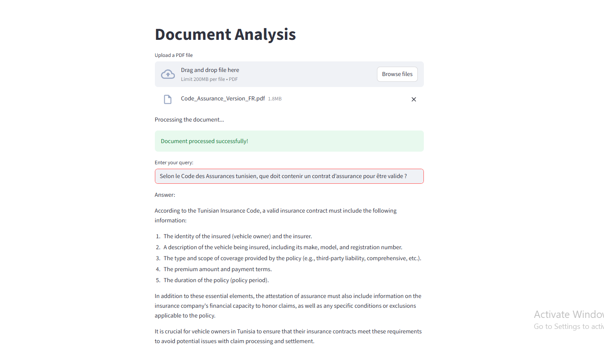

# Research Assistant for Insurance Policy Design & Analysis

A multi-agent AI system designed to analyze, summarize, and compare insurance documents, with a focus on comparing Tunisian insurance policies with international standards.

## 📋 Overview

This application leverages advanced Natural Language Processing (NLP) and Large Language Models (LLMs) to process insurance policy documents. It provides intelligent document analysis, semantic search capabilities, and comparative insights between Tunisian and international insurance policies.

### Key Features

- **📄 Document Processing**: Extract and process text from PDF insurance documents
- **🤖 Multi-Agent System**: Specialized agents for document analysis and enrichment
- **📝 Global Summarization**: Generate comprehensive summaries synthesized from chunk-level analysis
- **🔍 Semantic Search**: Vector-based similarity search for finding relevant information
- **💡 Intelligent Q&A**: Answer questions about insurance policies using context-aware AI
- **📊 Document Enrichment**: Automatic generation of summaries, keywords, and relevant questions
- **🌐 Policy Comparison**: Compare Tunisian insurance policies with international standards
- **⚡ Parallel Processing**: Efficient multi-threaded document enrichment

## Analyzer interface 
<p align="center">
  
</p>

The Analyzer is an agentic Retrieval-Augmented Generation (RAG) pipeline that converts heterogeneous documents into structured, queryable knowledge. It emphasizes fidelity to original structure (tables, headers, formatting), rich metadata, and fast semantic retrieval so the LLM can answer questions with accurate, provenance-backed context.

## Summarizer Agent

The **SummarizerAgent** is a specialized component that generates comprehensive global summaries from document chunks. Unlike simple concatenation, it intelligently synthesizes chunk-level summaries into a coherent, executive-level overview of the entire document.

### How it Works

1. **Context-Aware Processing**: Receives chunk summaries through a shared MCP (Multi-agent Context Protocol) context
2. **Intelligent Synthesis**: Uses advanced LLM prompting to combine chunk summaries while:
   - Eliminating redundancy
   - Maintaining logical flow
   - Preserving key information and relationships
   - Identifying recurring themes and major sections
3. **Faithful Summarization**: Ensures no hallucination - only information present in chunk summaries is included
4. **Professional Output**: Generates concise, well-structured summaries suitable for executives and researchers

### Key Features

- **Fallback Mechanism**: Can extract summaries from context or metadata
- **Structured Prompting**: Uses detailed instructions to ensure high-quality output
- **Theme Identification**: Recognizes and highlights recurring themes across document sections
- **Relationship Preservation**: Maintains cause-effect and procedural relationships from source material

Pipeline stages
1. Structure-aware chunking — segment text while preserving tables, headings, lists and other structural cues to avoid meaning loss.
2. Metadata enrichment — generate concise summaries, semantic keywords, and candidate questions for each chunk to improve retrieval precision.
3. Re-structuring & normalization — merge heterogeneous sources (PDFs, images, code snippets, tables) into a consistent internal schema with provenance links.
4. Parallel enrichment — run summarization, keyword extraction, and Q/A prompting concurrently for speed (ThreadPoolExecutor).
5. Embedding & vector database — create embeddings for enriched chunks and store them in FAISS for fast semantic search.
6. Relational metadata store — persist structured metadata, chunk provenance, and indexing state for audits and selective re-indexing.
7. Retriever + reranker — retrieve candidate chunks by semantic similarity and apply metadata-aware reranking (date, section, confidence).
8. RAG answer generation — the LLM composes answers using retrieved chunks, summaries, and source citations; responses include provenance and confidence signals.
9. Continuous indexing & feedback loop — support incremental updates, user feedback incorporation, and re-enrichment of changed documents.

Key benefits
- Higher relevance: enriched metadata and structure-aware chunking increase retrieval accuracy.
- Explainability: answers include citations and chunk-level provenance.
- Efficiency: parallel enrichment and compact embeddings reduce latency and token usage.
- Scalability: dual storage (FAISS + relational) enables large corpora with selective re-indexing.

Quick configuration pointers
- Chunking: configurable via CHUNK_SIZE and CHUNK_OVERLAP in src/agents/analyzer_agent.py
- Embeddings: set in src/utils/vector_store.py (default: sentence-transformers/all-MiniLM-L6-v2)
- LLM: change model/temperature in src/agents/analyzer_agent.py (default: ollama llama3:8b)
- Parallelism: tune ThreadPoolExecutor max_workers for CPU/memory trade-offs

<p align="center">
  
</p>


## 🏗️ Project Structure

```
Research_Assistant_for-Insurance_Policy_Design_Tech/
│
├── src/                          # Source code directory
│   ├── agents/                   # AI agents for document processing
│   │   ├── __init__.py
│   │   ├── analyzer_agent.py     # Main document analyzer agent
│   │   └── summarizer_agent.py   # Document summarization agent
│   │
│   ├── components/               # UI components
│   │   ├── __init__.py
│   │   └── document_uploader.py  # Document upload handler
│   │
│   ├── config/                   # Configuration files
│   │   ├── __init__.py
│   │   └── settings.py           # Application settings
│   │
│   ├── utils/                    # Utility functions
│   │   ├── __init__.py
│   │   ├── text_extractor.py     # PDF text extraction
│   │   ├── text_cleaner.py       # Text preprocessing and cleaning
│   │   ├── chunker.py            # Document chunking utilities
│   │   └── process_document.py   # Main document processing pipeline
│   │
│   ├── mcp.py                    # Shared context management for agents
│   └── app.py                    # Main Streamlit application
│
├── results/                      # Output directory for enriched chunks
├── uploads/                      # Directory for uploaded documents
├── requirements.txt              # Python dependencies
├── .gitignore                    # Git ignore rules
└── README.md                     # This file
```

## 🔧 Technology Stack

- **Frontend**: Streamlit
- **PDF Processing**: PyPDF
- **LLM Framework**: LangChain, LlamaIndex
- **Vector Store**: FAISS
- **Embeddings**: HuggingFace Sentence Transformers (all-MiniLM-L6-v2)
- **LLM**: Ollama (LLaMA 3 8B model)
- **Parallel Processing**: Python ThreadPoolExecutor

## 📦 Installation

### Prerequisites

- Python 3.8 or higher
- Ollama installed locally (for running LLaMA models)
- Git

### Step 1: Clone the Repository

```bash
git clone https://github.com/ner001/Research_Assistant_for-Insurance_Policy_Design_Tech.git
cd Research_Assistant_for-Insurance_Policy_Design_Tech
```

### Step 2: Create Virtual Environment

```bash
# Create virtual environment
python -m venv venv

# Activate virtual environment
# On Windows:
venv\Scripts\activate
# On macOS/Linux:
source venv/bin/activate
```

### Step 3: Install Dependencies

```bash
pip install -r requirements.txt
```

### Step 4: Install and Setup Ollama

1. **Install Ollama** from [ollama.ai](https://ollama.ai)

2. **Pull the LLaMA 3 model**:
```bash
ollama pull llama3:8b
```

3. **Verify Ollama is running**:
```bash
ollama list
```

### Step 5: Configure Environment Variables (Optional)

Create a `.env` file in the root directory if you want to customize settings:

```env
# API Configuration (if using external APIs)
API_KEY=your_api_key_here
API_URL=your_api_url_here

# Model Configuration
MODEL_NAME=llama3
CHUNK_SIZE=1000
CHUNK_OVERLAP=200
```

> **Note**: The application works with default settings even without a `.env` file.

## 🚀 How to Run

### Method 1: Using Streamlit (Recommended)

1. Navigate to the project directory:
```bash
cd Research_Assistant_for-Insurance_Policy_Design_Tech
```

2. Run the Streamlit app:
```bash
streamlit run src/app.py
```

3. Open your browser to `http://localhost:8501`

### Method 2: Using Python Directly

```bash
cd src
python -m streamlit run app.py
```

## 📖 Usage Guide

### Uploading and Analyzing Documents

1. **Launch the application** using one of the methods above
2. **Upload a PDF document** using the file uploader
3. **Wait for processing**: The system will:
   - Extract text from the PDF
   - Clean and preprocess the text
   - Chunk the document into manageable segments
   - Enrich each chunk with summaries, keywords, and questions
   - Create a vector store for semantic search
4. **Ask questions** about the document in the query input field
5. **Get AI-powered answers** based on the document content
6. **Generate Global Summary**: Click the "Generate Global Summary" button to create a comprehensive executive summary of the entire document

### Sample Queries

- "What are the coverage limits for life insurance?"
- "What are the exclusions in this policy?"
- "Compare the deductibles between different coverage types"
- "What are the claim procedures outlined in this document?"
- "Summarize the key benefits of this insurance policy"

## 🎯 Use Cases

### 1. Document Analysis
Automatically analyze insurance policy documents to extract key information, terms, and conditions.

### 2. Policy Comparison
Compare Tunisian insurance policies with international standards to identify differences and similarities.

### 3. Research Assistant
Quickly find specific information within large insurance documents through intelligent Q&A.

### 4. Knowledge Extraction
Generate summaries, extract keywords, and identify important concepts from insurance policies.

## 🔬 How It Works

### Document Processing Pipeline

1. **Text Extraction**: Extract raw text from PDF using PyPDF
2. **Text Cleaning**: Remove headers, footers, page numbers, and formatting artifacts
3. **Chunking**: Split document into overlapping chunks (configured: 2000 chars with 200 char overlap)
4. **Enrichment** (Parallel Processing):
   - Generate summaries for each chunk
   - Extract relevant keywords
   - Create hypothetical questions
5. **Embedding**: Convert enriched text to vector embeddings
6. **Vector Store**: Store in FAISS for fast similarity search
7. **Query Processing**: Find relevant chunks and generate answers using LLM

### Multi-Agent Architecture

- **DocumentAnalyzerAgent**: Main agent responsible for document processing, enrichment, and query answering
- **SummarizerAgent**: Specialized agent for generating comprehensive global summaries from chunk-level summaries
  - Synthesizes multiple chunk summaries into a coherent global summary
  - Uses context-aware processing via shared MCP (Multi-agent Context Protocol)
  - Eliminates redundancy while maintaining document fidelity
  - Produces executive-level summaries suitable for quick document understanding
- **Text Preprocessing**: Intelligent cleaning to reduce token load by 20-30%
- **Parallel Enrichment**: Uses ThreadPoolExecutor for concurrent chunk processing
- **Context-Aware Q&A**: Leverages document summaries, keywords, and original text for comprehensive answers
- **Shared Context (MCP)**: Thread-safe context management enabling agents to share metadata and summaries efficiently

## 🛠️ Configuration

### Chunk Size Settings

Modify chunk settings in `src/agents/analyzer_agent.py`:

```python
# In process_document method
self.chunks = self.chunk_text(
    self.cleaned_text, 
    chunk_size=2000,      # Currently configured chunk size
    chunk_overlap=200     # Currently configured overlap
)
```

Note: The `chunk_text` method has default parameters of `chunk_size=2500` and `chunk_overlap=300`, but `process_document` explicitly uses 2000 and 200 for optimal performance with the current LLM setup.

### LLM Settings

Change the LLM model in `src/agents/analyzer_agent.py`:

```python
self.llm = Ollama(
    model="llama3:8b",    # Change model here
    temperature=0.3       # Adjust temperature
)
```

### Embedding Model

Modify embedding model in `src/utils/vector_store.py`:

```python
embeddings = HuggingFaceEmbeddings(
    model_name="sentence-transformers/all-MiniLM-L6-v2"
)
```

## 🔒 Security Notes

- The `.env` file should never be committed to version control
- API keys and sensitive credentials should be stored in environment variables
- Uploaded documents are stored temporarily and should be managed according to your data retention policies

## 📊 Performance

- **Parallel Processing**: Uses 4 worker threads for chunk enrichment
- **Text Reduction**: Preprocessing reduces text by approximately 20-30%
- **Fast Search**: FAISS enables sub-second similarity searches
- **Efficient Embeddings**: Lightweight all-MiniLM-L6-v2 model for quick embedding generation

## 🤝 Contributing

Contributions are welcome! Please feel free to submit pull requests or open issues for bugs and feature requests.

## 📝 License

This project is provided as-is for research and educational purposes.

## 🐛 Troubleshooting

### Common Issues

**Issue**: "Ollama connection error"
- **Solution**: Ensure Ollama is installed and running. Run `ollama list` to verify.

**Issue**: "Module not found" errors
- **Solution**: Ensure all dependencies are installed: `pip install -r requirements.txt`

**Issue**: "Memory errors during processing"
- **Solution**: Reduce chunk size or process smaller documents

**Issue**: "Slow processing"
- **Solution**: Adjust `max_workers` in ThreadPoolExecutor or use a smaller LLM model

## 📧 Contact

For questions or support, please open an issue on the GitHub repository.

## 🎓 Academic Context

This project is designed for research in insurance policy analysis, with a particular focus on understanding and comparing Tunisian insurance regulations with international standards. It serves as a tool for insurance professionals, researchers, and policymakers.
